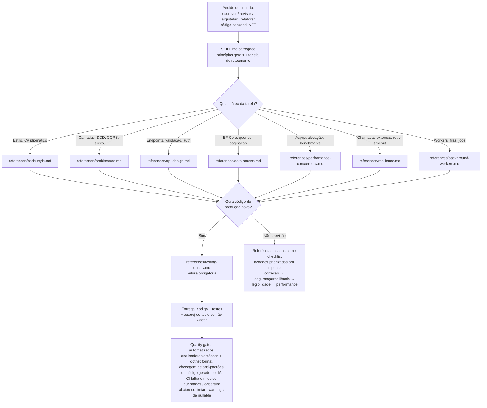

# dotnet-backend

Skill do Claude para código backend .NET/C#: código idiomático e legível, Clean Architecture com DDD e CQRS, design de APIs ASP.NET Core, acesso a dados com EF Core, performance e concorrência, resiliência (retry/circuit breaker/timeout), background workers/serviços hospedados, e testes/qualidade de código.

## Estrutura

```
dotnet-backend/
├── SKILL.md                              # ponto de entrada: princípios gerais + roteamento
└── references/
    ├── code-style.md                     # C# idiomático, nullable, records, pattern matching
    ├── architecture.md                   # Clean Architecture, DDD, CQRS, MediatR
    ├── api-design.md                     # ASP.NET Core, Minimal APIs, versionamento, auth
    ├── data-access.md                    # EF Core, N+1, paginação, Dapper
    ├── performance-concurrency.md        # async/await, Channels, Span<T>, BenchmarkDotNet
    ├── resilience.md                     # Polly: retry, circuit breaker, timeout, bulkhead
    ├── background-workers.md             # BackgroundService, filas, Hangfire/Quartz.NET
    └── testing-quality.md                # xUnit, TestContainers, CRAP score, quality gates
```

A raiz deste repositório **é** a skill — `SKILL.md` fica na raiz.

## Como a skill funciona

O `SKILL.md` é o ponto de entrada: carrega os princípios sempre válidos e uma tabela de roteamento que aponta qual referência ler conforme a área da tarefa. As referências são lidas sob demanda — só a(s) relevante(s) para a tarefa atual. A única leitura obrigatória em toda geração de código de produção novo é `testing-quality.md`, porque a entrega sempre inclui os testes.




## Instalação

### Claude Code (CLI)

**Por projeto** (recomendado — vale só para este repositório):

```bash
mkdir -p .claude/skills
git clone https://github.com/araujofilip/dotnet-backend.git .claude/skills/dotnet-backend
rm -rf .claude/skills/dotnet-backend/.git
```

**Global** (disponível em todos os seus projetos .NET):

```bash
mkdir -p ~/.claude/skills
git clone https://github.com/araujofilip/dotnet-backend.git ~/.claude/skills/dotnet-backend
rm -rf ~/.claude/skills/dotnet-backend/.git
```

O Claude Code carrega qualquer skill presente em `.claude/skills/<nome>/SKILL.md` automaticamente — não precisa de comando de instalação adicional.

### Claude.ai / Cowork

1. Gere o arquivo compactado da skill:
   ```bash
   git clone https://github.com/araujofilip/dotnet-backend.git
   cd dotnet-backend
   zip -r ../dotnet-backend.skill . -x ".git/*"
   ```
2. Envie o arquivo `.skill` numa conversa do Claude (Cowork ou claude.ai) e clique em **Salvar skill** no card que aparece.

### GitHub Copilot

```bash
mkdir -p .github/skills
git clone https://github.com/araujofilip/dotnet-backend.git .github/skills/dotnet-backend
rm -rf .github/skills/dotnet-backend/.git
```

### OpenCode

```bash
mkdir -p ~/.config/opencode/skills
git clone https://github.com/araujofilip/dotnet-backend.git ~/.config/opencode/skills/dotnet-backend
rm -rf ~/.config/opencode/skills/dotnet-backend/.git
```

## Uso

A skill dispara automaticamente quando você pede para escrever, revisar, arquitetar ou refatorar código backend em .NET/C# — APIs, workers, camadas de domínio, repositórios, migrations, handlers CQRS, etc. Também pode ser invocada explicitamente com `/dotnet-backend` (Claude Code) ou mencionando a skill pelo nome.

## Fontes

Os padrões desta skill foram sintetizados a partir de referências .NET com adoção ativa da comunidade: o conjunto de skills [dotnet-skills](https://github.com/Aaronontheweb/dotnet-skills) (padrões de produção para C#, EF Core, Aspire e testes), o subagente [csharp-developer](https://github.com/VoltAgent/awesome-claude-code-subagents) (Clean Architecture, CQRS, ASP.NET Core), e guias de Clean Architecture/CQRS/FluentValidation amplamente referenciados pela comunidade .NET.

## Licença

MIT — adapte livremente para o seu contexto.
